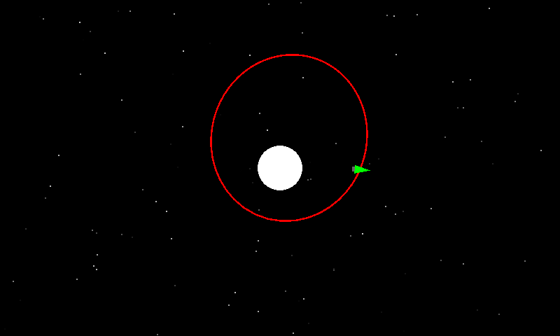
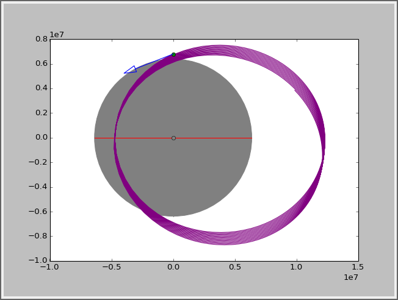
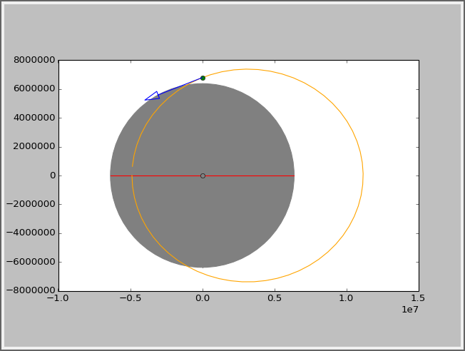
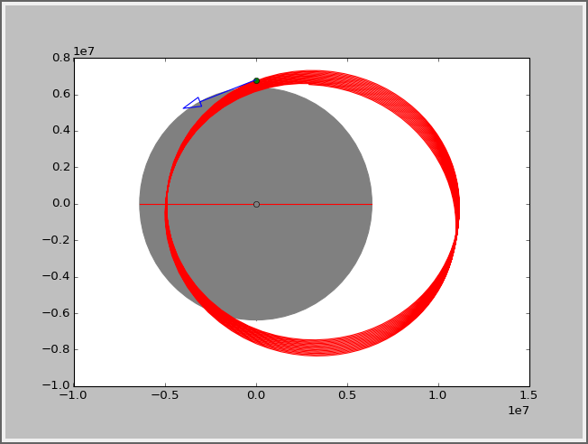
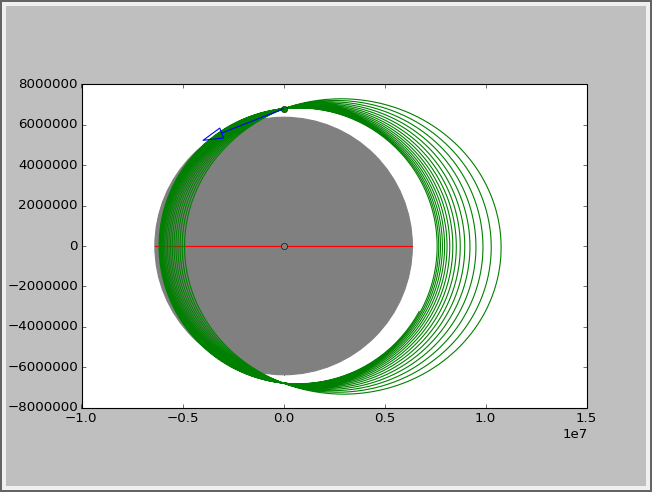
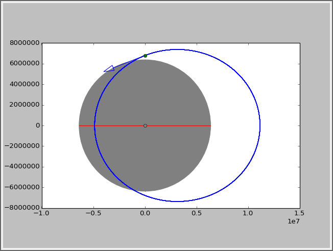

KivyOrbiter
===========

a little orbit simulation game written in python using kivy

Key Features
- It currently uses an RK4 (Runge Kutta Fourth Order) integrator for the orbital motion.
- It works on android using the kivy app.
- Orbit Path calculation is in a seperate thread, improving framerate performance... I hope

Example Output
-----------

### Kivy Application ###

To use the kivy application, place finger on the screen and move in the direction desired for engine vector

###orbitstest.py testing output###

  
Euler Integration

  
Kepler Integration

  
Verlet Integration

  
TCVerlet Integration

  
RK4 Integration

