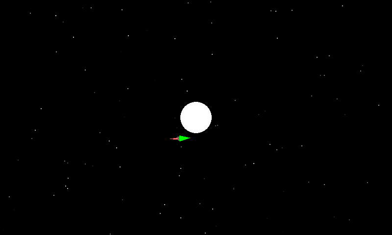

KivyOrbiter
===========

a little orbit simulation game written in python using kivy

Key Features
- It currently uses an RK4 (Runge Kutta Fourth Order) integrator for the orbital motion.
- It works on android using the kivy app.
- Orbit Path calculation is in a seperate thread, improving framerate performance... I hope

Example Output
-----------

### Kivy Application ###



To use the kivy application, place finger on the screen and move in the direction desired for engine vector

### Installation ###

You will need `kivy` installed in order to run this application. Instructions for all platforms can be found at https://kivy.org/#download

### Running ###

After following the installation instructions, you can run the application using the following command:

```
python main.py
```

###orbitstest.py testing output###

  
Euler Integration

  
Kepler Integration

  
Verlet Integration

  
TCVerlet Integration

  
RK4 Integration

